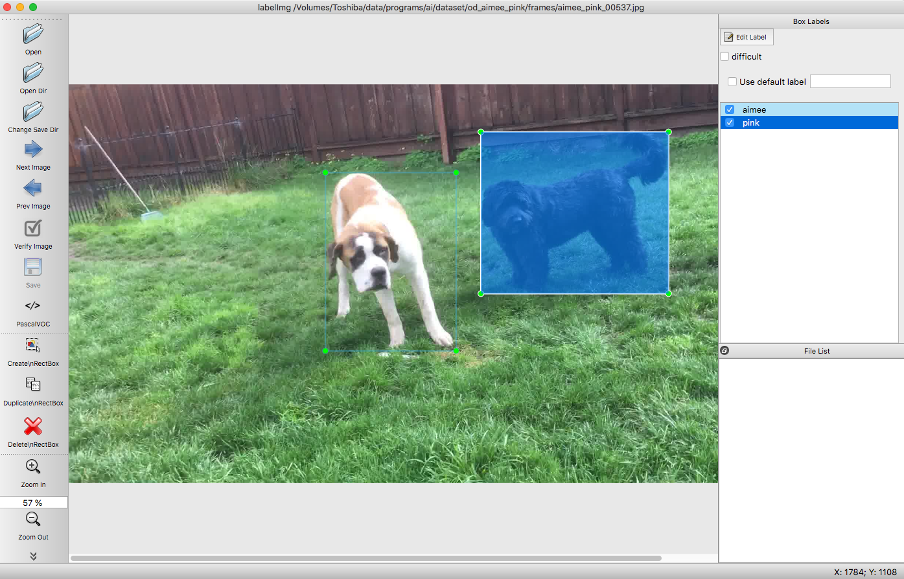

# Using Custom Classes to Train and Predict with TensorFlow Object Detection API
Hide Inada

# Overview
Object detection is used to automatically identify the position of objects in an image.
This is a huge advance comparing with image classification which only provides the class of an object.
For example, [my image classification app](https://github.com/hideyukiinada/ic) can predict 1000 classes, but does not return the location of each object.
Is it difficult to use a machine learning system detect an object?  Not really.  If you use a pre-trained model, it is easy to do so.  However you can only classify the location of objects the model was trained for. For example, the below photo shows images of puppies with my dog Aimee at a puppy social. Though all puppies were detected, they are all marked as a dog, and you don't know which one is Aimee.  

For you to detect an object that was not in the model, then more steps are needed.

Here are the logical steps:
1. Obtain the machine learning software
2. Verify that object detection works with sample images
3. Create your own dataset for object detection
4. Download the pre-trained model to use as a base
5. Train the model with your dataset
6. Convert the model to be used for prediction
7. Run prediction with the model

No matter what ML software you use, I believe that these steps are the same or similar.
Using these steps, I was able to train the model with my own dataset and used the model for predicting positions of my dogs.

I used TensorFlow Object Detection API, and I would like to go over step-by-step how I did it.  You do _not_ need to know about machine learning to follow this tutorial, but need to know Python to make modifications to scripts.

I'd also like to thank authors of articles I used as a reference.  They are listed at the bottom of this page.

# What you need to actually go through the steps yourself
## Software
* TensorFlow
* Python
* PIP
* Software to mark the location of object (e.g. labelImg)

## Hardware
* Hardware to run training & prediction
If you run training locally, I strongly recommend a machine with a GPU.  I believe that you can run training in Google's cloud but I haven't tried that myself.

## Skills
* Python programming skill

# Steps
## Step 1. Obtain the machine learning software
### 1.1. Set up TensorFlow
You need TensorFlow on your machine.
[This page on TensorFlow website](https://www.tensorflow.org/install/pip) has instructions.

### 1.2. Download Object Detection API source code
```
git clone https//github.com/tensorflow/model
```

### 1.3. Navigate to the main directory
Once you check out the code, cd into the main directory:
```
cd models/research/object_detection
```
You can also have a look at [read me on Github](https://github.com/tensorflow/models/tree/master/research/object_detection).

## Step 2. Verify that object detection works with sample images
### 2.1. Convert the tutorial from Jupyter notebook to a regular Python file (Optional)
This step is optional if you like to work with Jupyter notebook instead of a regular Python script.

In models/research/object_detection, you'll find a file called

object_detection_tutorial.ipynb

You want to convert this to a Python script by typing:

```
jupyter nbconvert --to script object_detection.ipynb
```

This produces a script called object_detection.py in the current directory.

At the end of the script, it contains the code to display a sample image using matplotlib, but I had a problem in matplotlib on my box, so I added code to save images on the file system using the PIL package.

At the end of the step, 

??? Add photo here.

This photo is included in the source tree and licensed under [Apache License 2.0](https://github.com/tensorflow/models/blob/master/LICENSE)

## Step 3. Create your own dataset for object detection
There are four sub steps in this step:

1. Get images
2. Obtain a software product to mark location of your objects in each image
3. Mark a location in each image
4. Convert the image and location data into a file format that your ML software can process

### Step 3.1. Get images
I used my iPhone and recorded a video of my dogs Aimee and Pink for about 4 minutes 40 seconds.  I exported jpeg images from the MOV file with 3 frames/second.  I got 839 jpeg images with the below command:

```
ffmpeg -i IMG_6204.MOV -vf fps=3 ../frames/aimee_pink_%05d.jpg
```
### Step 3.2. Obtain a software product to mark location of your objects in each image
I used a product called labelImg.  [https://github.com/tzutalin/labelImg](https://github.com/tzutalin/labelImg) has detailed steps to install.  I set up labelImg on my Mac so these steps are for that.  I think steps for Linux will be slightly different.

I followed the steps the listed on the above page.  As I already had python & pip set up, I started with:
```
pip install py2app
pip install PyQt5
```
After installing PyQt5, I typed the below command to verify that PyQt5 resource compiler was successfully installed.
```
pyrcc5
```  

Then I cloned the repo and followed the steps on the page. (Note I already had lxml so pip install lxml did not install it.)
```
git clone https://github.com/tzutalin/labelImg 
cd labelImg 
make qt5py3
rm -rf build dist
python setup.py py2app -A
mv "dist/labelImg.app" /Applications
```

With these steps, you now have labelImg installed in your Applications folder.

## Step 3.3. Mark a location in each image 
Marking a location for each object means:

* Identify an object in each image
* Marking a bounding box for each object.

At the end of this step, for each image file, you want to have a corresponding XML file that containing the coordinates of objects in the image.



Below is the actual file (aimee_pink_00537.xml) that was created for the image aimee_pink_00537.jpg.
```
<annotation>
        <folder>frames</folder>
        <filename>aimee_pink_00537.jpg</filename>
        <path>/Volumes/Toshiba/data/programs/ai/dataset/od_aimee_pink/frames/aimee_pink_00537.jpg</path>
        <source>
                <database>Unknown</database>
        </source>
        <size>
                <width>1920</width>
                <height>1080</height>
                <depth>3</depth>
        </size>
        <segmented>0</segmented>
        <object>
                <name>aimee</name>
                <pose>Unspecified</pose>
                <truncated>0</truncated>
                <difficult>0</difficult>
                <bndbox>
                        <xmin>695</xmin>
                        <ymin>239</ymin>
                        <xmax>1049</xmax>
                        <ymax>722</ymax>
                </bndbox>
        </object>
        <object>
                <name>pink</name>
                <pose>Unspecified</pose>
                <truncated>0</truncated>
                <difficult>0</difficult>
                <bndbox>
                        <xmin>1116</xmin>
                        <ymin>129</ymin>
                        <xmax>1624</xmax>
                        <ymax>567</ymax>
                </bndbox>
        </object>
</annotation>

```

This format is called [PASCAL VOC](http://host.robots.ox.ac.uk/pascal/VOC/) format. (If you want to view a dataset tagged with this format, I found that you can download from the [GluonCV's website](https://gluon-cv.mxnet.io/build/examples_datasets/pascal_voc.html))

Using labelImg was straightforward, but it took a long time to go through. labelImg has short cut keys and they helped a lot.  Out of 839 images that I had, I went through 749 images and some of the images did not have any dogs, and I also annotated 3 images with the text format by mistake. I annotated 707 files.

### Step 3.4. Convert the image and location data into a file format that your ML software can process
Now you have a set of JPEG images and corresponding XML files in the annotation directory.
In this step, you need to combine all of them into a single TFRecord format that the training script needs.

I made a copy of models/research/object_detection/create_pascal_tf_record.py and modified it so that it reads from my image and annotation directories.

At the end, I was able to create a file called dog.tfrecords.  If you follow this step, please make sure that the generated .tfrecords file is not very small.  I tweaked directory names and resulted in a very small tfrecords file, which wasn't right.

## Step 7. Train the model.

### Downloading the pre-trained model
https://github.com/tensorflow/models/blob/master/research/object_detection/g3doc/detection_model_zoo.md has the list of pre-trained model.
I downloaded faster_rcnn_resnet50_coco model.

Corresponding config file was already in the source tree.
samples/configs/faster_rcnn_resnet50_coco_config

num_classes: 3
fine_tune_check_point: path where the downloaded model was copied
tf_record_input_reader | "input_path: " : path to the tf records file that I have created.
label_map_path: path to the label_map file that I have created
 
I wasn't able to locate train.py at the object_detection directory where others listed in their articles.
I did a search on the internet and found out that the script was moved to the directory called legacy.

I tweaked the train.py to do the following:
??? (to be updated)

I stopped training at 30956 step with loss = 0.0803
The last step took 0.233 sec/step.

I believe that you need to follow the instructions below page to export the model:
https://github.com/tensorflow/models/blob/master/research/object_detection/g3doc/exporting_models.md

Note I haven't done this process myself yet.

# References
&#91;1&#93; Priyanka Kochhar, Building a Toy Detector with Tensorflow Object Detection API, https://www.kdnuggets.com/2018/02/building-toy-detector-tensorflow-object-detection-api.html

&#91;2&#93; Dat Tran, How to train your own Object Detector with TensorFlow’s Object Detector API, https://towardsdatascience.com/how-to-train-your-own-object-detector-with-tensorflows-object-detector-api-bec72ecfe1d9

&#91;3&#93; Harrison, Training Custom Object Detector - Tensorflow Object Detection API Tutorial, https://pythonprogramming.net/training-custom-objects-tensorflow-object-detection-api-tutorial/?completed=/creating-tfrecord-files-tensorflow-object-detection-api-tutorial/

&#91;4&#93; Harrison, Testing Custom Object Detector - Tensorflow Object Detection API Tutorial, https://pythonprogramming.net/testing-custom-object-detector-tensorflow-object-detection-api-tutorial/?completed=/training-custom-objects-tensorflow-object-detection-api-tutorial/

&#91;5&#93; BalA VenkatesH, TensorFlow object detection with custom objects, https://medium.com/coinmonks/tensorflow-object-detection-with-custom-objects-34a2710c6de5
